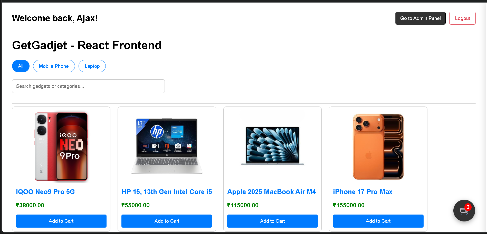

# 🛒 GetGadjet Store - React Edition

A modernized, full-stack e-commerce application featuring a React frontend, a containerized PHP API, and a managed cloud database.

---

## 🚀 Live Demo
**Frontend:** [https://get-gadjet-store-react.vercel.app/](https://get-gadjet-store-react.vercel.app/)  
**Backend API:** [https://getgadjet-store-api.onrender.com/](https://getgadjet-store-api.onrender.com/)

---

## 🏗️ Architecture Overview
This project represents a migration from a legacy PHP monolith to a distributed cloud architecture:
- **Frontend:** React.js (Vite) for a fast, responsive UI.
- **Backend:** PHP 8.2 API hosted in a **Docker** container on Render.
- **Database:** Managed MySQL via **Aiven.io**.
- **Deployment:** CI/CD integration with GitHub, Vercel, and Render.

---

## ✨ Key Upgrades
- **Faster Browsing:** Switched to React so the page doesn't have to reload every time you click something.
- **Security:** Moved database passwords out of the code and added them into "environment variables" so they stay private.
- **Database Reliability:** Moved the data to a professional cloud service (Aiven.io) instead of basic local hosting.
- **State Management:** Efficient React state handling for Cart logic and Admin dashboards.
- **Fixed Image Loading:** Connected the React frontend to the PHP backend images using a dynamic URL system.

---

## 🚀 Future Enhancements
- **Payment Integration:** Planning to integrate a real payment gateway like Razorpay or Stripe for actual transactions.
- **User Profiles:** Add a dashboard where customers can see their past order history and save their address.
- **Real-Time Search:** Make the search bar suggest products instantly as the user types.
- **Inventory Alerts:** Notify the admin automatically when a product is running low on stock.

---

## 🛠️ Tech Stack
- **Frontend:** React, CSS.
- **Backend:** PHP (MySQLi), Docker.
- **Database:** Managed MySQL (Aiven.io).
- **Hosting:** Vercel (Frontend), Render (API).

---

## 📸 Preview
**

---

## 🛠️ Installation & Setup
1. Clone the repository.
2. Install dependencies: `npm install`
3. Configure `src/config.js` with your API URL.
4. Start development: `npm run dev`

---

## 📂 Project Structure

```
GetGadjet-React/
├── src/  
│   ├── components/
│   │   ├── CartSideBar.jsx
│   │   ├── Navbar.jsx
│   │   ├── ProductCard.jsx
│   │   ├── ProductModal.jsx  
│   │   ├── Admin
│   │   │   ├── AddProduct.jsx   
│   │   │   ├── LoginForm.jsx
│   │   │   ├── OrderDetailsModal.jsx
│   │   │   ├── OrderDetails.jsx
│   │   │   ├── RegisterForm.jsx         
├── image.png 
├── public/
├── package.json              
└── .gitignore                 

```

---

## Author
**Teja Janga**
* GitHub: [@Teja-Janga](https://github.com/Teja-Janga)

---

*👨‍💻Project Developed by Teja Janga*